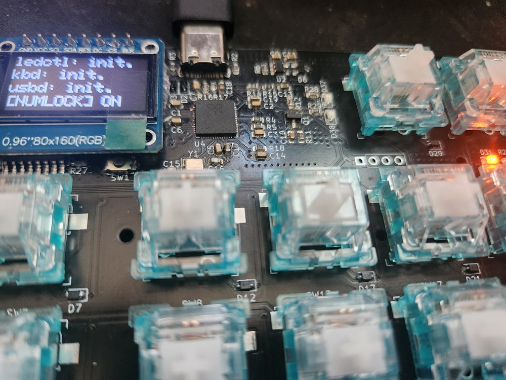
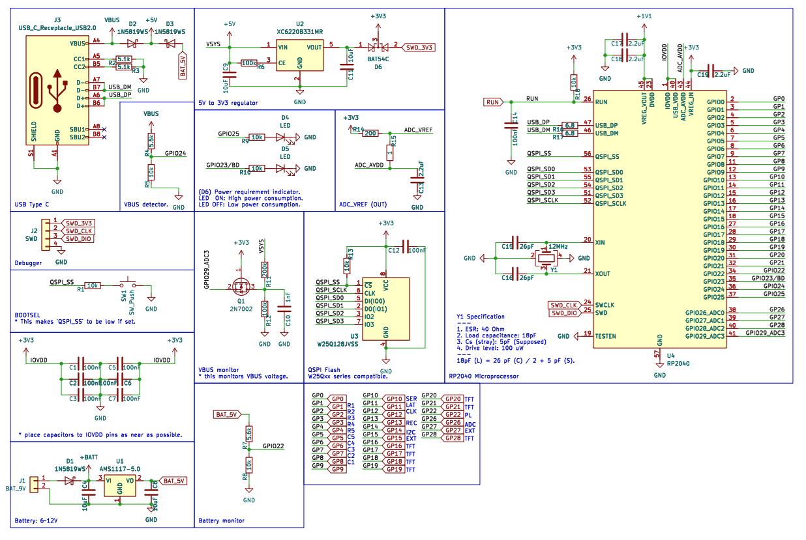

# Simple Number Pad

### Schematic

See `hw/pdf/*.pdf` files to read more details.

### Features
* MCU: RP2040, 133MHz Dual core.
* 5 keys for user-defined functions.
* 17 keys for number pad.
* `TFT` display for calculator if no `HID` attached.
* 2 macro control keys, `RECORD` and `PLAY`.

### Plans for future features
* A flash memory to store user configurations? (currently, they're stored at `SRAM` of MCU only, so, volatile)
* I2C or SPI extension port?
* A little game that runs on the `TFT` display?
* Anything else...

### Firmware
WIP yet.
